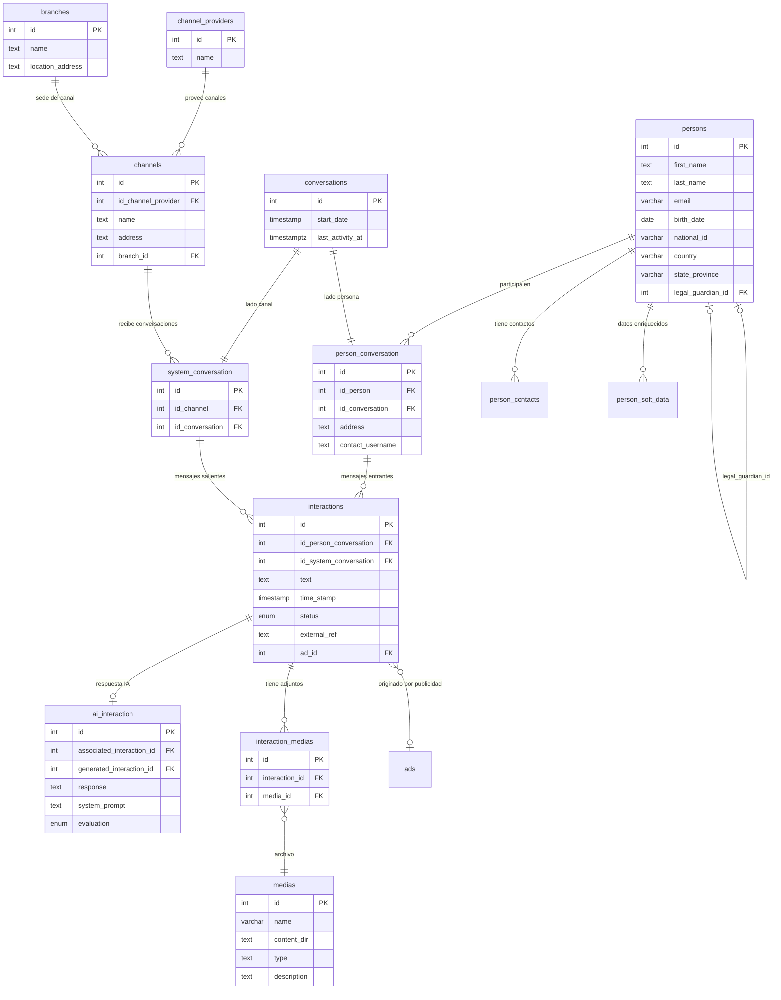
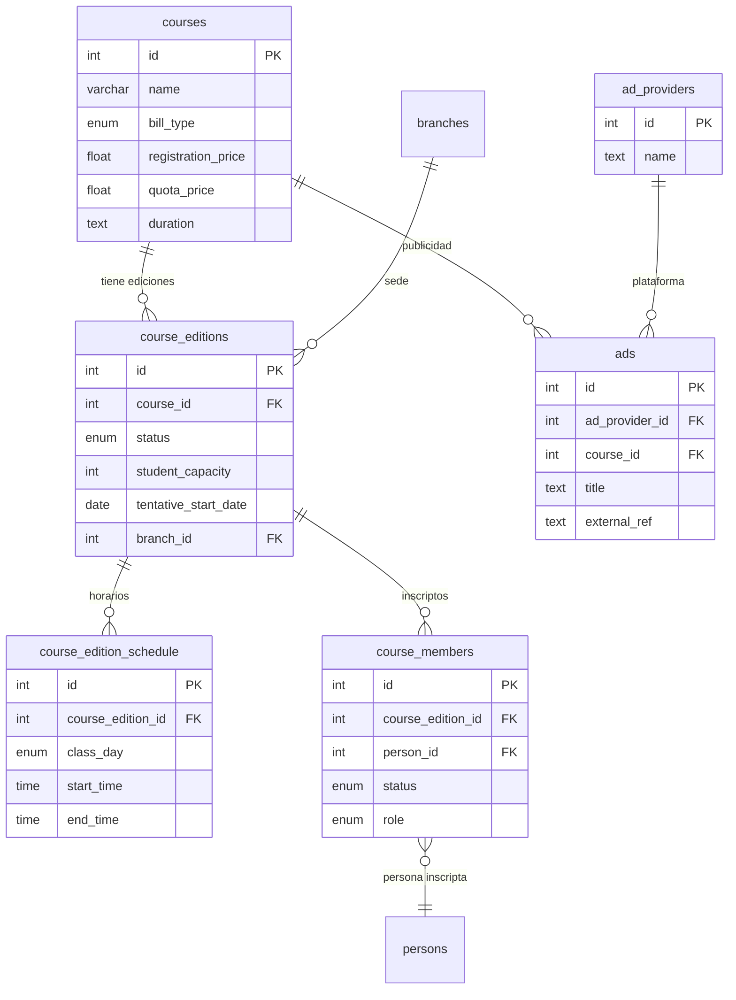
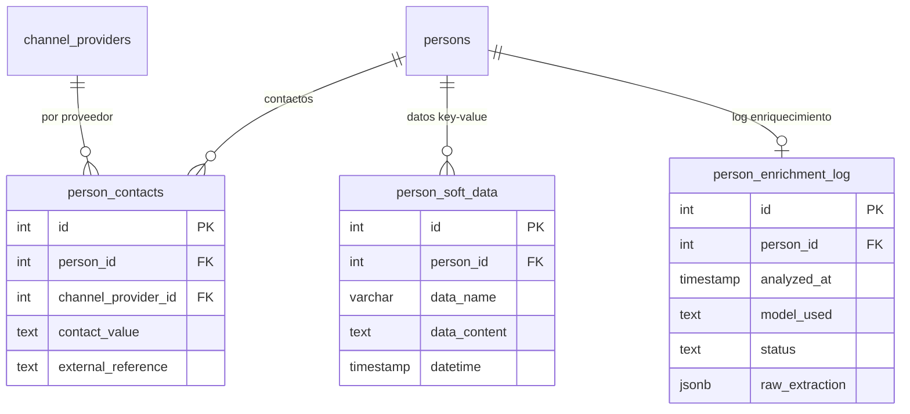
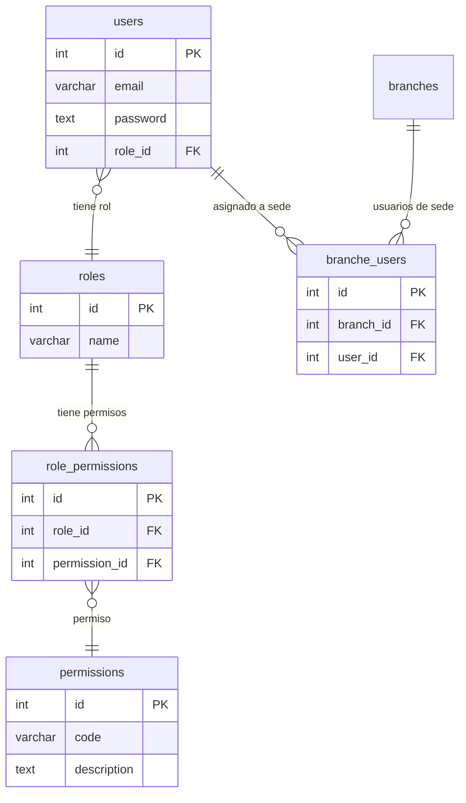

# IITA CRM — Diagrama Entidad-Relacion

> **Generado desde:** PostgreSQL 17, Supabase `cpkzzzwncpbzexpesock`
> **Ultima actualizacion:** 2026-02-20
> **Formato:** Mermaid (renderiza en GitHub, VS Code, Notion)

## Nucleo: Mensajeria

## Cursos e inscripciones

## Contactos y datos enriquecidos

## RBAC (no implementado)

