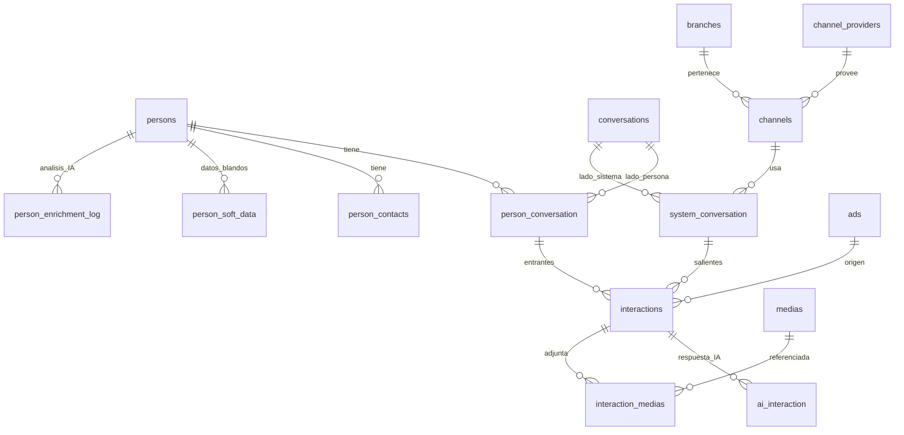
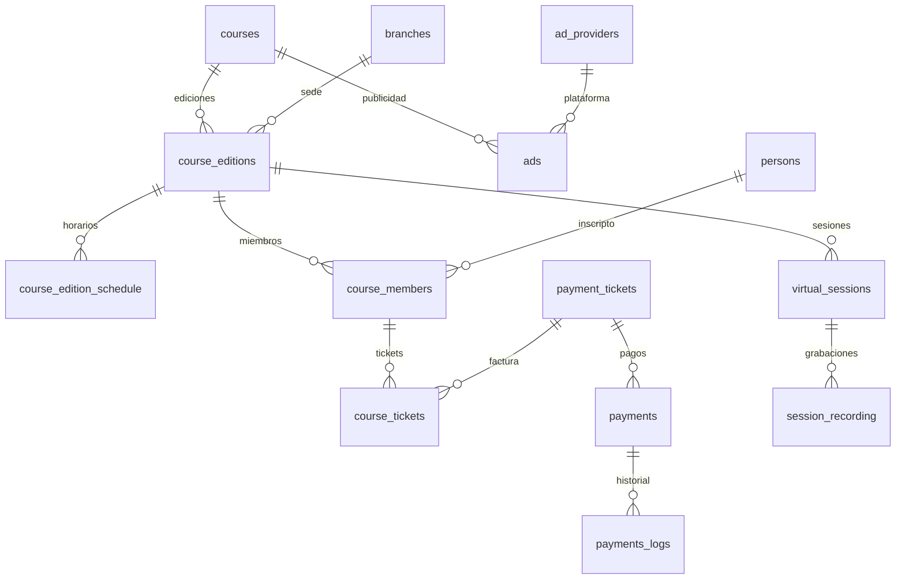
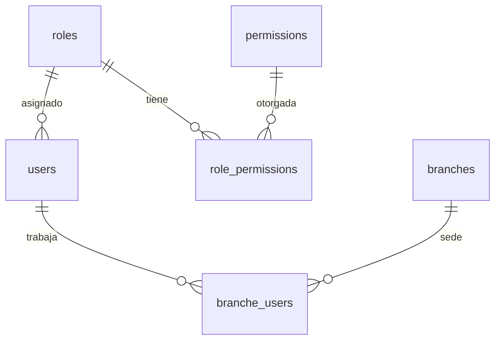

# Diagrama Entidad-Relacion — IITA CRM

Ultima actualizacion: 2026-02-20 | Autor: gviollaz + Claude Opus 4.6

## Diagrama 1: Nucleo de mensajeria

Nota: interactions tiene constraint chk_single_direction.

## Diagrama 2: Cursos y pagos

## Diagrama 3: RBAC (no implementado)

## 36 Foreign Keys

| Tabla origen | Campo FK | Tabla destino |
|---|---|---|
| ads | ad_provider_id | ad_providers |
| ads | course_id | courses |
| ai_interaction | associated_interaction_id | interactions |
| ai_interaction | generated_interaction_id | interactions |
| channels | branch_id | branches |
| channels | id_channel_provider | channel_providers |
| course_editions | course_id | courses |
| course_members | person_id | persons |
| interactions | id_person_conversation | person_conversation |
| interactions | id_system_conversation | system_conversation |
| person_contacts | person_id | persons |
| person_conversation | id_person | persons |
| person_conversation | id_conversation | conversations |
| person_enrichment_log | person_id | persons |
| person_soft_data | person_id | persons |
| persons | legal_guardian_id | persons |
| system_conversation | id_channel | channels |
| system_conversation | id_conversation | conversations |
| users | role_id | roles |
| virtual_sessions | id_course_edition | course_editions |
