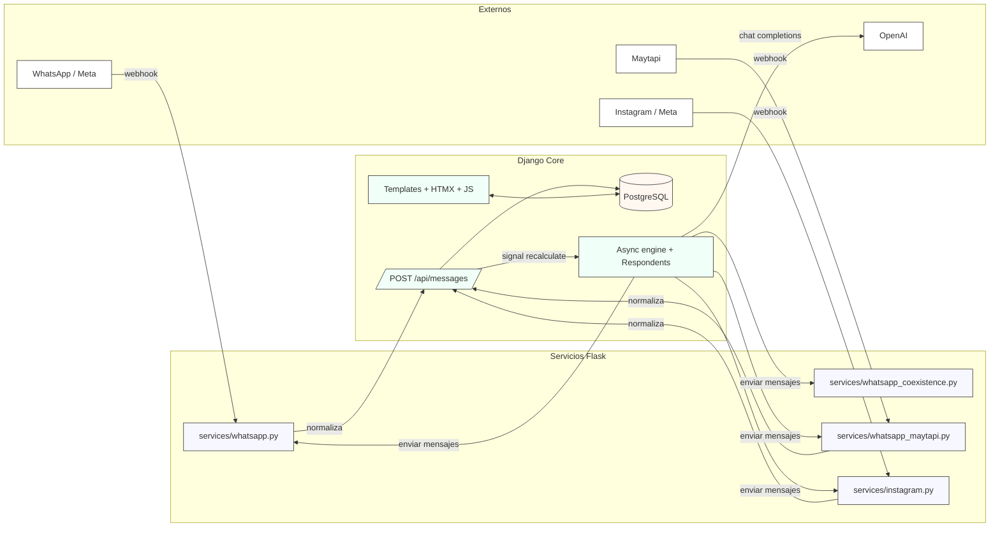
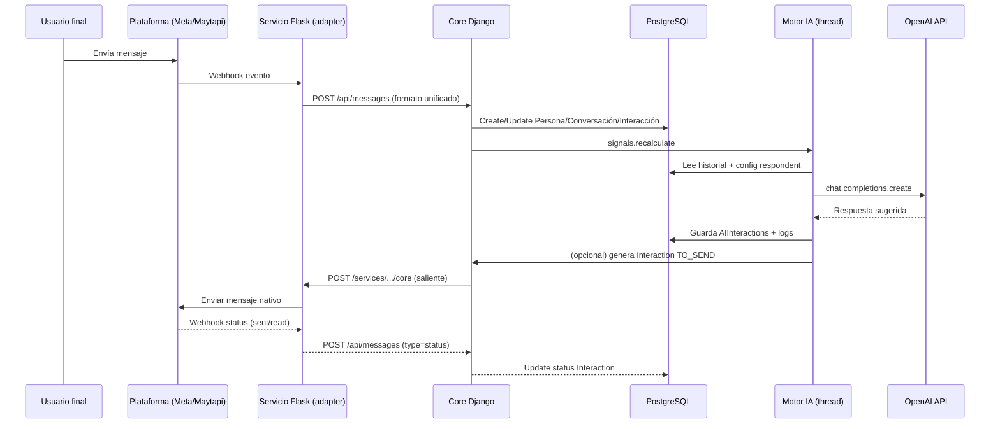

# Documentación técnica — Chatbot IITA 2.0 (snapshot)

**Fecha del análisis:** 2026-02-21  
**Fuente analizada:** `chatbot-main.zip` (código del repositorio *IITA-Proyectos/chatbot* en el momento del export).  
**Lenguaje principal:** Python 3.11  
**Frameworks:** Django (core) + Flask (servicios/adaptadores de mensajería)

> Nota: esta documentación describe lo que *existe en el código* del snapshot. Si el repositorio cambió luego del zip, puede haber diferencias.

---

## Índice

1. [Visión general](#visión-general)  
2. [Stack tecnológico y dependencias](#stack-tecnológico-y-dependencias)  
3. [Estructura del repositorio](#estructura-del-repositorio)  
4. [Arquitectura del sistema](#arquitectura-del-sistema)  
   1. [Componentes](#componentes)  
   2. [Flujo de mensajes end-to-end](#flujo-de-mensajes-end-to-end)  
   3. [Procesamiento asíncrono y motor de IA](#procesamiento-asíncrono-y-motor-de-ia)  
   4. [Persistencia y modelo de datos](#persistencia-y-modelo-de-datos)  
   5. [Frontend / UI](#frontend--ui)  
   6. [Diagrama de arquitectura](#diagrama-de-arquitectura)  
5. [Módulos del Core (Django)](#módulos-del-core-django)  
6. [Servicios / adaptadores de chat (Flask)](#servicios--adaptadores-de-chat-flask)  
7. [APIs y contratos](#apis-y-contratos)  
8. [Configuración (variables de entorno)](#configuración-variables-de-entorno)  
9. [Despliegue y operación](#despliegue-y-operación)  
10. [Funcionalidades detectadas](#funcionalidades-detectadas)  
11. [Observaciones técnicas y oportunidades de mejora](#observaciones-técnicas-y-oportunidades-de-mejora)  
12. [Guía rápida para extender el sistema](#guía-rápida-para-extender-el-sistema)

---

## Visión general

Este proyecto implementa una plataforma de atención y gestión de conversaciones (*chat center*) con soporte multi-canal (WhatsApp / Instagram, y un proveedor alternativo de WhatsApp vía Maytapi). La solución está dividida en:

- **Core** (Django):  
  - UI web para operadores (listas de chats, mensajes, clientes, intereses/etiquetas, cursos, difusión, parámetros de IA).  
  - API interna unificada para entrada/salida de mensajes (`/api/messages`).  
  - Persistencia de contactos, conversaciones, mensajes, adjuntos, plantillas y logs de IA en PostgreSQL.  
  - Motor de sugerencias/respuestas mediante IA (OpenAI) + modo automático (autorespuesta).

- **Servicios** (Flask):  
  Adaptadores por proveedor/plataforma (WhatsApp Cloud API, WhatsApp Coexistence, Maytapi, Instagram, dummy). Su función es traducir entre el **contrato interno del Core** y las APIs específicas de cada plataforma, además de exponer endpoints de webhook.

La idea clave: el Core **no habla "nativo" Meta/Maytapi**. Habla un formato propio (serializers `IncomingSerializer`/`OutgoingSerializer`) y delega en adaptadores.

---

## Stack tecnológico y dependencias

Dependencias declaradas en `requirements.txt` (principales):

- Django 5.1 (core web + ORM)
- Django REST Framework (serialización / endpoint API)
- Flask 3 (servicios de mensajería)
- openai 1.42 (consumo de Chat Completions)
- psycopg2-binary (PostgreSQL)
- gunicorn (servir WSGI en prod)
- nginx (reverse proxy; configuración fuera del repo)
- cryptography (Fernet para encriptar API keys)
- python-dotenv (cargar `.env`)
- requests (HTTP hacia proveedores y entre servicios)
- django-user-agents (plantillas/UX diferenciada móvil)
- debug toolbar / pyinstrument (debug y profiling)

---

## Estructura del repositorio

Árbol resumido (hasta 3 niveles):

```text
chatbot-main/
├── docs/
│   ├── api/
│   │   ├── crm.md
│   │   └── messages.md
│   ├── brainstorming/
│   │   ├── ai_training_alternatives
│   │   └── possible_techonologies.md
│   ├── UI/
│   │   ├── home-contactinfo.png
│   │   ├── home-dashboard.png
│   │   ├── home.png
│   │   └── login.png
│   ├── architecture.md
│   ├── docs.md
│   ├── er_diagram.md
│   └── vm_backups.md
├── src/
│   ├── chatbot/
│   │   ├── __init__.py
│   │   ├── asgi.py
│   │   ├── settings.py
│   │   ├── urls.py
│   │   └── wsgi.py
│   ├── core/
│   │   ├── comandos/
│   │   ├── migrations/
│   │   ├── serializers/
│   │   ├── static/
│   │   ├── templates/
│   │   ├── utils/
│   │   ├── __init__.py
│   │   ├── admin.py
│   │   ├── api.py
│   │   ├── apps.py
│   │   ├── async_processes.py
│   │   ├── forms.py
│   │   ├── load_data_test.py
│   │   ├── longProcess.py
│   │   ├── Middleware.py
│   │   ├── models.py
│   │   ├── respondents.py
│   │   ├── signals.py
│   │   ├── tests.py
│   │   ├── urls.py
│   │   └── views.py
│   ├── services/
│   │   ├── common.py
│   │   ├── dummy_service.py
│   │   ├── example.env.whatsapp_coexistence
│   │   ├── instagram.py
│   │   ├── whatsapp.py
│   │   ├── whatsapp_coexistence.py
│   │   └── whatsapp_maytapi.py
│   ├── deploy.py
│   └── manage.py
├── .gitignore
├── README.md
├── requirements.txt
└── setup.sh
```

Lectura rápida por carpetas:

- `docs/`: documentación existente (arquitectura, API, ERD, operación de VM, capturas UI).
- `src/chatbot/`: configuración del proyecto Django (settings, urls, wsgi/asgi).
- `src/core/`: app principal (modelos, vistas, API, async engine, IA, templates, static).
- `src/services/`: adaptadores de mensajería (Flask).
- `src/deploy.py`: script de orquestación (levanta core + servicios con gunicorn).
- `setup.sh`: setup de servidor (Postgres, Nginx, Python).

---

## Arquitectura del sistema

### Componentes

**1) Core (Django)**  
Responsabilidades principales:

- Persistir y consultar:
  - Empresas/sucursales/canales (`Companies`, `Branches`, `CompanyComChannels`)
  - Personas/identidades por canal (`Persons`, `PersonComChannels`)
  - Conversaciones e interacciones (`Conversations`, `Interactions`)
  - Media adjunta (`Media`)
  - Intereses/etiquetas (`Interests`, `PersonByInterest`)
  - Configuración de IA (proveedores, modelos, parámetros, valores, respondents)
  - Cursos y ediciones (`Courses`, `CourseEdition`)
  - Configuración general (`Settings`)
- Exponer UI web (Django templates + HTMX + JS).
- Exponer endpoint de entrada de mensajes (POST `/api/messages`).
- Enviar mensajes salientes al servicio correspondiente (HTTP POST al `endpoint_url` del `ChatProvider` del canal empresa).

**2) Servicios (Flask) / "Adapters"**  
Cada servicio implementa:

- Un endpoint "core->servicio" (ej. `/services/whatsapp/core`) que recibe el formato unificado de salida y lo traduce a la plataforma.
- Un endpoint "plataforma->servicio" (webhook) que recibe eventos nativos (Meta/Maytapi) y los traduce a formato unificado de entrada para enviarlo al Core (`/api/messages`).
- En algunos casos, endpoints extra (por ejemplo plantillas para WhatsApp).

**3) Proveedores externos**
- WhatsApp Cloud API (Meta)
- Instagram Messaging API (Meta)
- Maytapi (tercero)
- OpenAI (IA)

**4) Base de datos**
- PostgreSQL para el Core.

---

### Flujo de mensajes end-to-end

El sistema implementa un patrón "Hub & Spokes":

1. La plataforma (ej. WhatsApp) envía un webhook al **servicio**.
2. El servicio:
   - valida/verifica (según implementación),
   - normaliza el evento al formato interno,
   - reenvía al Core vía `POST /api/messages`.
3. El Core:
   - crea o actualiza entidad Persona / canal persona,
   - crea o reusa Conversación,
   - inserta Interacción (y Media si aplica),
   - dispara una señal interna (`signals.recalculate`) para ejecutar lógica asíncrona.
4. El motor asíncrono:
   - genera sugerencias IA (AIInteractions) si corresponde,
   - y/o envía mensajes pendientes (`Interactions` con status `TO_SEND`) llamando al adaptador del canal.
5. El servicio envía el mensaje a la plataforma.
6. La plataforma notifica estados (sent/read/etc) al webhook del servicio → servicio → Core → se actualiza el `status` de la interacción.

---

### Procesamiento asíncrono y motor de IA

El Core maneja asíncronía de forma "in-process" (threads), no con una cola externa:

- Existe una señal Django: `core.signals.recalculate`.
- Se emite al recibir mensajes (`core/api.py`) y al crear mensajes salientes (`respondents.send_new_message`).
- Un receiver (`core/async_processes.py`) mantiene un lock global por proceso y dispara un thread que ejecuta:
  - creación de `RespondentCache` para conversaciones sin respondent,
  - generación de respuestas IA cuando el último mensaje es del usuario y no hay respuesta IA posterior,
  - envío de cualquier `Interaction` en estado `TO_SEND`,
  - y, si está habilitado `Settings.automonitor`, envío automático de la respuesta IA.

**IA y prompt**
- La clase `respondents.OpenAI` construye un prompt "system" combinando:
  - Instrucciones fijas (quién es la empresa, tono, reglas),
  - Valores tipo "prompt" (características) seleccionados desde `RespondentCache`,
  - Datos contextuales: valores tipo string/number + lista de cursos + datos de la persona (nombre, región, tags).
- El modelo se selecciona desde un Value de tipo `ai_model` dentro del respondent (si falta, dispara error y se recrea respondent).

---

### Persistencia y modelo de datos

La base modela:

- **Canales** de la empresa (CompanyComChannels) vs canales de personas (PersonComChannels).  
  Esto permite identificar correctamente:
  - quién envía (empresa / persona),
  - por qué canal específico (ej. "WhatsApp Portafolio" vs "WhatsApp Cursos"),
  - y con qué proveedor/adaptador hablar.

- **Conversations** agrupa interacciones por par (company_channel, person_channel) mientras `end` sea NULL.

- **Interactions** representa cada mensaje/acción con:
  - `sender`: `person` o `respondent`,
  - `status`: lifecycle (TO_SEND/SENT/RECEIVED/READ/FAILED…),
  - `provider_message_id`: id externo (Meta/Maytapi),
  - `media`: FK opcional a Media.

- **AIInteractions** y **AIInteractionLog** registran sugerencias IA, aceptación/edición, rating y feedback.

---

### Frontend / UI

UI basada en:

- Django templates (`src/core/templates/…`)
- HTMX para carga parcial (componentes, modals, tablas).
- JS "liviano" para polling y utilidades.

Funcionalidades UI principales detectadas (por vistas + templates):

- **Home** / dashboard.
- **Listado de chats** con filtros (canal/owner, etiquetas, búsqueda, pendientes).
- **Vista chat** (mensajes, adjuntos, estados, envío manual, plantillas, rating/feedback).
- **Clientes** (lista, detalle, editar datos, intereses/etiquetas).
- **Intereses** (CRUD).
- **Cursos** y **ediciones** (CRUD).
- **Parámetros IA** (crear/editar parámetros y valores).
- **Difusión**: envío masivo de plantillas a personas filtradas por etiquetas.
- Versiones específicas para móvil (detectadas por `django-user-agents`).

---

### Diagrama de arquitectura

#### Diagrama de componentes (alto nivel)



#### Secuencia simplificada: mensaje entrante y respuesta



---

## Módulos del Core (Django)

Esta sección describe los módulos/archivos relevantes y su función.

### `src/chatbot/` (configuración Django)

- `settings.py`:  
  - Lee variables de entorno vía `dotenv`.  
  - Configura BD Postgres (`DB_*`), `SITE_ID`, `DEBUG_MODE`.  
  - Define apps instaladas (incluye `core`, DRF, debug tools, user agents).  
  - Static/media (media en `/var/www/...` en prod).  

- `urls.py`: enruta `admin/` + incluye `core.urls`.

- `wsgi.py`: punto WSGI (Gunicorn).

### `src/core/models.py` (modelo de dominio)

Modelos principales (resumen):

**Empresa y canales**
- `Companies`: empresa (nombre, industria) + M2M a `AIProviders`.  
- `CompaniesData`: archivos/datos asociados a empresa (no muy usados en lógica actual).  
- `Branches`: sucursales; flag `client_support` para habilitar atención.  
- `ChatProviders`: proveedor de chat y endpoint URL del adaptador.
- `CompanyComChannels`: canal "de la empresa" (sucursal + provider + address + group_address + name).

**Personas, conversaciones, mensajes**
- `Persons`: contacto (nombre, región, email, teléfono, DNI, cumpleaños, etc).
- `PersonComChannels`: identidad de una persona por proveedor (chat_provider + address + group_address + time_out).
- `Conversations`: conversación entre `CompanyComChannels` y `PersonComChannels` (start/end; respondent asignado).
- `Interactions`: mensaje individual con estado, texto, media, timestamps, sender (person/respondent), flags (`postponed`).
- `Media`: archivo subido o descargado (FileField + mimetype + name).

**Etiquetas**
- `Interests`: etiqueta/tag (nombre + descripción).
- `PersonByInterest`: relación many-to-many persona ↔ etiqueta.

**IA**
- `AIProviders`: proveedor IA (endpoint, api_key encriptada, límites).  
- `AIModels`: modelos por proveedor.  
- `AIParams`: "parámetros" configurables (tipo: prompt/string/number/ai_model).  
- `Values`: valores posibles de cada parámetro (string/number/model) + `chance` para random.  
- `RespondentCache`: set de Values elegido para un respondent (persona AI) — M2M con Values.
- `AIInteractionLog`: registro inmutable de request/response, prompt, rating, feedback, edición.
- `AIInteractions`: sugerencia IA para una conversación (texto, accepted, failed, final_interaction).

**Cursos**
- `Courses`: curso (modalidad, duración, info, esquema de cobro).  
- `CourseEdition`: edición por sucursal (días/horarios/edad/estado/fecha estimada).

**Settings**
- `Settings`: actualmente solo `automonitor` (autorespuesta).

> El ERD existente en `docs/er_diagram.md` está alineado conceptualmente, aunque hay referencias históricas a modelos que ya no están presentes.

### `src/core/api.py` (API unificada de mensajes)

Funciones y responsabilidades:

- `message_endpoint` (`POST /api/messages`):  
  Endpoint que recibe mensajes normalizados desde los servicios.  
  Internamente usa `process_incoming(...)` y luego dispara `signals.recalculate`.

- `process_incoming(...)`:  
  Decide si el payload es de tipo `message` o `status` (otros tipos están validados por serializer pero no implementados).

- `__process_message(...)` (privada):  
  - Deduplicación por `provider_message_id`.
  - Determina si el emisor es "la empresa" comparando con direcciones registradas en `CompanyComChannels`.
  - Crea `Persons` y `PersonComChannels` si no existen.
  - Busca/crea `Conversations` abiertas (end=None).
  - Maneja media: guarda base64 en `Media` y crea interacciones.

- `__process_status(...)` (privada):  
  Actualiza el `status` de una interacción usando `provider_message_id`.

- `send_message(interaction)`:  
  Construye un payload de salida (OutgoingSerializer) y lo envía al `endpoint_url` del proveedor configurado en el canal de empresa.  
  Si hay media, genera una URL pública vía `/render-file/<filename>`.

### `src/core/serializers/`

- `incoming.py`: define el esquema de entrada (message/edit/deletion/status).  
- `outgoing.py`: define el esquema de salida (message) + `MessageResponseSerializer`.  
- `common.py`: serializers compartidos (Address, Sender/Recipient, Media, etc).

Estos serializers son el "contrato" principal entre adaptadores y core.

### `src/core/async_processes.py` (motor asíncrono)

- Registra un receiver de `signals.recalculate`.
- Mantiene un `Lock` global por proceso + bandera `do_reload`.
- Proceso principal:
  1. Crear respondents faltantes en conversaciones abiertas.
  2. Determinar qué conversaciones requieren IA (último mensaje del usuario, IA no generada).
  3. Ejecutar IA en threads (particionando en max 5 concurrentes).
  4. Enviar mensajes pendientes `TO_SEND`.
  5. Si `Settings.automonitor` está activo, auto-enviar la respuesta IA.

### `src/core/respondents.py` (IA y envío humano/auto)

- `RespondentNotFoundError` / `InvalidRespondentError`: errores de configuración.
- `create_random_respondent()`: arma `RespondentCache` seleccionando Values por chance.
- `OpenAI.get_chat_completion(conv)`: arma prompt y llama a `openai` (Chat Completions).
- `send_new_message(...)`: crea `Interactions` saliente (TO_SEND) + guarda feedback/rating si se usó una sugerencia IA.

### `src/core/views.py` (UI)

Conjunto grande de vistas que sostienen el panel web. Algunos highlights:

- Autenticación: `CustomLoginView`, logout, home.
- Chats: `chats_list`, `messages`, `data_person`, `automatic_mode`, `mark_as_pendient`.
- Polling "generating": `generating` y `ultimate_conversation_chats` para UX de respuesta IA.
- Clientes: `client_list`, `client_detail`, `saveDataPerson`, `download_contacts`.
- Intereses: CRUD.
- Cursos y ediciones: CRUD.
- Parámetros IA y Values: CRUD parcial vía JSON.
- Plantillas: `getTemplate` y `sendTemplate` (envío simple o difusión masiva).

### `src/core/longProcess.py` (difusión masiva)

Implementa envío masivo de plantillas en un thread:

- Filtra personas por tags incluidos y excluidos.
- Envía template por cada persona (creando Interaction TO_SEND).
- Opcional: crea un nuevo tag y lo asigna a destinatarios (tracking de campaña).

---

## Servicios / adaptadores de chat (Flask)

### Contrato general

Los servicios esperan mensajes en el formato unificado del Core y devuelven un JSON con:

- `message_id` (id asignado por el proveedor), o
- `error` en caso de falla.

Y para entrada, envían al Core un payload con estructura compatible con `IncomingSerializer`.

---

### `src/services/whatsapp.py` (Meta WhatsApp Cloud API)

Endpoints:

- `POST /services/whatsapp/core`  
  Recibe mensaje del Core y lo envía a Meta Graph API (`/messages`).  
  Implementa envío de:
  - Texto
  - Media (imagen/video/documento) usando multipart y `messaging_product=whatsapp`.

- `GET /services/whatsapp/meta`  
  Verificación del webhook (`hub.verify_token`).

- `POST /services/whatsapp/meta`  
  Recepción de mensajes/status desde Meta.  
  - Valida firma (`x-hub-signature-256`) usando `services.common.is_signature_valid`.
  - Normaliza message/status y reenvía al Core.

- `GET /services/whatsapp/core/template`  
  Obtiene templates aprobadas (API de plantillas de WhatsApp).

- `POST /services/whatsapp/core/template`  
  Envía una plantilla a un destinatario.

Notas:
- Maneja descarga de media entrante vía Graph (`/MEDIA_ID` → URL → content base64).

---

### `src/services/whatsapp_coexistence.py` (WhatsApp Cloud API - coexistence)

Endpoints:

- `POST /services/whatsapp_coexistence/core`  
  Envío de texto o media. Para media usa `link` (URL pública), no upload.

- `GET /services/whatsapp_coexistence/webhook`  
  Verificación.

- `POST /services/whatsapp_coexistence/webhook`  
  Recepción de mensajes/status y forwarding al Core.

Incluye utilidades extra:
- `subscribe_waba_to_app`: suscripción de WABA a la app (Graph API).
- Descarga de media a base64 (similar al servicio whatsapp).

---

### `src/services/whatsapp_maytapi.py` (Maytapi)

Endpoints:

- `POST /services/wp_maytapi/core` (en realidad usa `SERVICE_NAME = "wp_maytapi"`)  
  Envía mensajes salientes usando Maytapi `sendMessage`.

- `POST /services/wp_maytapi/webhook`  
  Recibe mensajes entrantes (estructura Maytapi) y los traduce al formato unificado.

Características:
- Configura webhook automáticamente al iniciar (setWebhook) y lista teléfonos (listPhones).
- Estructura de media: lista de items con `url` (no base64).

---

### `src/services/instagram.py` (Meta Instagram)

Endpoints:

- `GET /services/instagram/meta`  
  Verificación webhook.

- `POST /services/instagram/meta`  
  Recibe eventos. Actualmente procesa solo texto (attachments no implementado).

- `POST /services/instagram/core`  
  Envía texto hacia Graph API `/messages`.

---

### `src/services/dummy_service.py`

Servicio de prueba que simula envío y responde `message_id`.

---

## APIs y contratos

### Core

- `POST /api/messages`  
  Entrada unificada desde servicios.  
  Tipos soportados por serializer: `message`, `status`, `edit`, `deletion`  
  Implementados en lógica: `message` y `status`.

- `GET /render-file/<filename>`  
  Sirve archivos adjuntos almacenados en `Media` para que proveedores puedan descargarlos.  
  Incluye lógica de "disposition" para descargas.

- Endpoints internos de UI:
  - `/internal/generating` y `/internal/ultimate_interaction` (polling).

### Contrato unificado de mensajes

La especificación formal está en `docs/api/messages.md`.  
En el código, los contratos están en:
- `core/serializers/incoming.py`
- `core/serializers/outgoing.py`

Campos clave (conceptuales):
- `provider`: string (ej. "whatsapp", "instagram", "wp_maytapi"…)
- `sender` / `recipient`: `{address, group_address, timeout?}`
- `message`: `{id, text, media[]}`
- `status`: `{message_id, status}`

---

## Configuración (variables de entorno)

Hay un `.env` base para el Core y `.env.<servicio>` por adaptador (no versionados en el repo).

Variables detectadas en docs/código (resumen):

**Core (`src/.env`)**
- `DB_NAME`, `DB_USER`, `DB_PASS`, `DB_HOST`, `DB_PORT`
- `DJANGO_SECURITY_KEY`
- `ENCRYPTION_KEY`
- `DEBUG_MODE` (true/false)
- `SITE_ID`
- `CHATBOT_SERVER_DOMAIN` (para construir URLs)
- `INTERNAL_IP`
- `USE_HTTPS` (usada para armar URLs externas en algunos lugares)

**WhatsApp (Meta)**
- `VERIFY_WEBHOOK_TOKEN`
- `META_ACCESS_TOKEN`
- `META_ADS_TOKEN` (para anuncios; no visto en lógica principal del servicio)
- `META_APP_SECRET`
- `SEND_TO_META` (si false: modo simulación)

**WhatsApp Coexistence**
- `WABA_ID`, `PHONE_NUMBER_ID`
- `APP_ID`, `APP_SECRET`
- `SYSTEM_USER_TOKEN`
- `VERIFY_TOKEN`
- `SEND_TO_META`
- `HOST`, `PORT`

**Maytapi**
- `PRODUCT_ID`, `API_KEY`
- `CORE_MESSAGES_ENDPOINT`
- `HOST`, `PORT`

**Instagram**
- Variables análogas a Meta (token y verify token).  
  (El repo no incluye un ejemplo, pero el servicio espera `META_ACCESS_TOKEN`, `VERIFY_WEBHOOK_TOKEN` u otros según implementación.)

---

## Despliegue y operación

### Orquestación con `src/deploy.py`

El repo incluye un script que levanta servicios con Gunicorn:

- Modos:
  - `dev-local`: usa `python manage.py runserver` (solo core).
  - `dev`: gunicorn con `--reload` (core + servicios).
  - `prod`: gunicorn sin reload (core + servicios).

Comandos:
- `python3 deploy.py run <modo> all`
- `python3 deploy.py restart <modo> all`
- `python3 deploy.py list`
- `python3 deploy.py kill all`

Logs:
- `/var/log/gunicorn/<service>_<mode>.log`
- `/var/log/gunicorn/error_<service>_<mode>.log`
PID files:
- `/var/run/gunicorn/<service>_<mode>.pid`

### Nginx

Nginx actúa como reverse proxy HTTPS hacia:
- core (Django) y
- cada servicio (Flask)
en puertos distintos.

La config de Nginx no está en el repo (se gestiona en `/etc/nginx/sites-available` según docs).

---

## Funcionalidades detectadas

### Mensajería / omnicanal

- Integración con:
  - WhatsApp (Meta Cloud API)
  - WhatsApp Coexistence
  - WhatsApp Maytapi
  - Instagram
  - Servicio dummy para testing
- Normalización de mensajes (formato interno).
- Manejo de estados (sent/read/failed, etc).
- Deduplicación por `provider_message_id`.
- Soporte de adjuntos/media:
  - Descarga de media entrante (WhatsApp)
  - Almacenamiento en `Media`
  - Visualización en UI (img/video/audio/pdf/descarga)
  - Reenvío como URL pública (`/render-file/...`) o upload según servicio

### Gestión de conversaciones

- Creación automática de contactos al recibir mensajes nuevos.
- Conversaciones abiertas por par canal-empresa ↔ canal-persona.
- Lista de chats con:
  - búsqueda por texto,
  - filtro por canal/owner,
  - filtro por etiquetas,
  - marcado "pendiente" (postponed),
  - UI móvil diferenciada.

### CRM básico

- Edición de datos de Persona (nombre, región, etc).
- Etiquetas (Interests) y asignación (PersonByInterest).
- Exportación de contactos a vCard (`/download/contacts`).

### IA (asistida y automática)

- Configuración de proveedores/modelos/params.
- Generación automática de sugerencias por conversación.
- UI con "generando…" y autocompletado del texto sugerido (polling).
- Registro de:
  - prompt y request,
  - respuesta IA,
  - aceptación/edición,
  - rating (1-5) y feedback textual.
- `Settings.automonitor`: modo autorespuesta (envía automáticamente lo que generó la IA).

### Cursos y ediciones

- CRUD de cursos.
- CRUD de ediciones por sucursal, con estado, horarios, edades, fecha estimada.
- Cursos aparecen en el contexto del prompt IA (para que el bot "sepa" la oferta).

### Plantillas y difusión

- Obtención de plantillas desde proveedor (WhatsApp).
- Envío de plantillas:
  - a un usuario puntual desde el chat,
  - o masivamente desde "Difusión", filtrando por etiquetas.
- Etiqueta/campaña de difusión (creación de tag "Diffusion_YYYY-MM-DD" y asignación automática).

---

## Observaciones técnicas y oportunidades de mejora

Estas observaciones surgen del análisis del código (no son "errores", pero sí puntos a vigilar):

1. **Asincronía basada en threads dentro de Django**  
   - Ventaja: simple, sin infraestructura extra.  
   - Riesgo: con múltiples workers/procesos (gunicorn) pueden existir ejecuciones en paralelo que generen condiciones de carrera (ej. dos procesos enviando el mismo `TO_SEND` si no hay locking a nivel DB).  
   - Alternativa clásica: Celery/RQ + Redis (o un job runner) con "idempotencia" por mensaje.

2. **Polling cada 2s desde el frontend**  
   - Funciona, pero escala regular con muchos operadores.  
   - Alternativa: WebSockets (Django Channels) o Server-Sent Events.

3. **Validación de seguridad de webhooks**  
   - WhatsApp (servicio `whatsapp.py`) valida firma `x-hub-signature-256`.  
   - Instagram y coexistence no validan firma en este snapshot (o no se ve).  
   - Recomendación: aplicar verificación equivalente para todos los webhooks.

4. **Campos parcialmente implementados**  
   - `IncomingSerializer` soporta `edit` y `deletion`, pero `core/api.py` no los procesa.
   - `Interactions.respond` se usa para filtrar generación IA, pero no se setea desde el flujo principal (parece feature incompleta o heredada).

5. **Envío de media**  
   - `whatsapp.py` envía media subiendo bytes (multipart).  
   - `whatsapp_coexistence.py` envía media por link (requiere que `/render-file` sea accesible públicamente).  
   Esto está bien, pero conviene documentar claramente qué adaptador usa qué estrategia.

6. **Selección de AIProvider "first()"**  
   - El Core toma el primer AIProvider asociado a la empresa.  
   - Si hay más de uno, no hay lógica de selección por canal, prioridad o fallback.

7. **Logs y trazabilidad**  
   - Se guardan logs IA (prompt y request) en DB, lo cual es buenísimo para auditoría, pero ojo con datos sensibles: conviene políticas de retención/redacción.

---

## Guía rápida para extender el sistema

### Agregar un nuevo canal/proveedor de mensajería

1. Crear un nuevo archivo en `src/services/` con una app Flask.
2. Implementar:
   - `POST /services/<nombre>/core` (recibe payload outgoing y envía a plataforma).
   - `POST /services/<nombre>/webhook` o ruta que requiera la plataforma (recibe webhook y reenvía a `/api/messages`).
3. Asegurar que los payloads cumplan con serializers del Core.
4. Agregar `.env.<nombre>` con `HOST` y `PORT` + credenciales.
5. Agregar el servicio a `deploy.py` (lista `cmds`) para modo dev/prod.
6. Configurar Nginx para rutear la URL pública hacia el puerto del servicio.
7. En el Core (admin), crear `ChatProviders` con `endpoint_url` apuntando a `http://127.0.0.1:<port>/services/<nombre>/core`.

### Agregar/ajustar la "personalidad" del bot

- Crear/editar `AIParams` (tipo `prompt` para instrucciones).
- Crear/editar `Values` con `chance`.
- Verificar que exista un parámetro `ai_model` y algún value con un `AIModels` válido.
- El respondent se construye de forma aleatoria por conversación.

### Habilitar autorespuesta

- En UI: endpoint `api/automatic_mode` modifica `Settings.automonitor`.
- Cuando está activo, el engine envía automáticamente el último `AIInteractions.text` si el último mensaje es del usuario.
