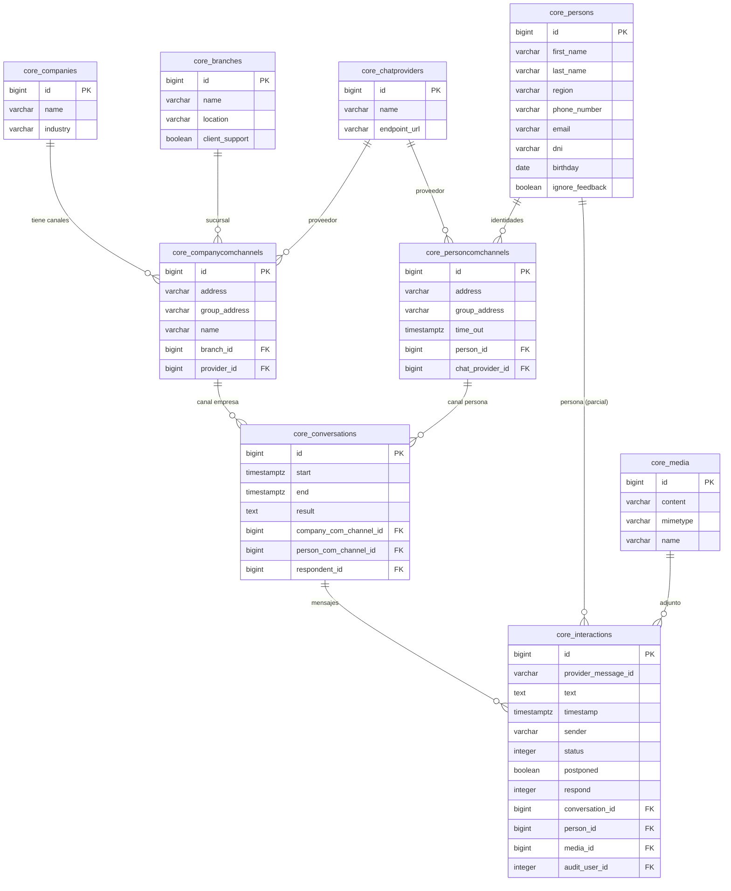
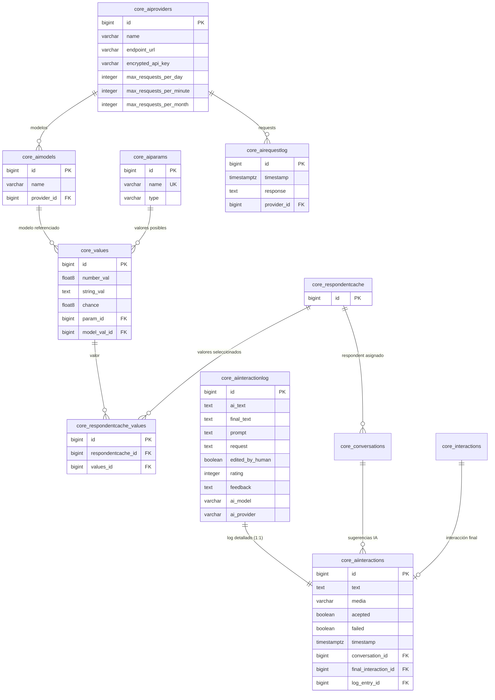
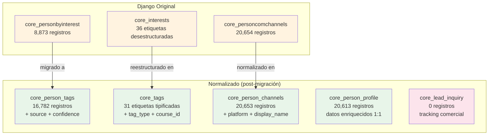

# Diagramas Entidad-Relación — Base de Datos Legacy

Última actualización: 2026-02-21 | Validado contra datos de producción

---

## 1. Dominio Principal: Personas, Conversaciones y Mensajes



---

## 2. Sistema de IA y Respondents



---

## 3. Etiquetas, Intereses y Cursos

```mermaid
erDiagram
    core_courses {
        bigint id PK
        varchar name
        varchar modality
        text additional_information
        varchar duration
        varchar bill_type
        integer quota_price
        integer registration_price
    }
    
    core_courseedition {
        bigint id PK
        varchar status
        varchar class_day
        time start_time
        time end_time
        integer min_age
        integer max_age
        date tentative_start_date
        bigint course_id FK
        bigint branch_id FK
    }

    core_interests {
        bigint id PK
        varchar name
        text description
    }
    
    core_personbyinterest {
        bigint id PK
        bigint interest_id FK
        bigint person_id FK
    }
    
    core_tags {
        bigint id PK
        varchar name
        varchar tag_type
        varchar modality
        text description
        boolean is_active
        bigint course_id FK
    }
    
    core_person_tags {
        bigint id PK
        varchar source
        float8 confidence
        bigint person_id FK
        bigint tag_id FK
    }
    
    core_person_profile {
        bigint person_id PK_FK
        varchar localidad
        varchar provincia
        varchar pais
        integer edad_consultada
        varchar consulta_para
        varchar preferencia_modalidad
        varchar source
    }
    
    core_lead_inquiry {
        bigint id PK
        varchar status
        varchar channel
        integer edad_alumno
        boolean es_para_si_mismo
        varchar modalidad_preferida
        bigint person_id FK
        bigint course_id FK
        bigint conversation_id FK
    }

    core_courses ||--o{ core_courseedition : "ediciones"
    core_branches ||--o{ core_courseedition : "sucursal"
    core_courses ||--o{ core_tags : "curso vinculado"
    core_interests ||--o{ core_personbyinterest : "interés"
    core_persons ||--o{ core_personbyinterest : "persona"
    core_tags ||--o{ core_person_tags : "tag"
    core_persons ||--o{ core_person_tags : "persona"
    core_persons ||--|| core_person_profile : "perfil 1:1"
    core_persons ||--o{ core_lead_inquiry : "consultas"
    core_courses ||--o{ core_lead_inquiry : "curso consultado"
```

---

## 4. Tablas Normalizadas vs. Originales



---

## 5. Flujo de un Mensaje (nivel datos)

```mermaid
flowchart LR
    A[WhatsApp/Meta] -->|webhook| B[Servicio Flask]
    B -->|POST /api/messages| C[Core Django]
    
    C --> D{¿Persona existe?}
    D -->|No| E[CREATE core_persons<br/>+ core_personcomchannels]
    D -->|Sí| F[Buscar conversación abierta]
    E --> F
    
    F --> G{¿Conversación abierta?}
    G -->|No| H[CREATE core_conversations<br/>+ core_respondentcache]
    G -->|Sí| I[Usar existente]
    H --> J
    I --> J
    
    J[INSERT core_interactions<br/>sender=person, status=RECEIVED]
    J --> K[signal: recalculate]
    
    K --> L[Motor IA Thread]
    L --> M[OpenAI chat.completions]
    M --> N[INSERT core_aiinteractions<br/>+ core_aiinteractionlog]
    
    N --> O{¿Automonitor ON?}
    O -->|Sí| P[INSERT core_interactions<br/>sender=respondent, status=TO_SEND]
    O -->|No| Q[Esperar aprobación humana]
    Q --> P
    
    P --> R[POST a servicio Flask]
    R --> S[Meta API: enviar mensaje]
    S --> T[Webhook status: SENT/READ]
    T --> U[UPDATE core_interactions.status]
```


